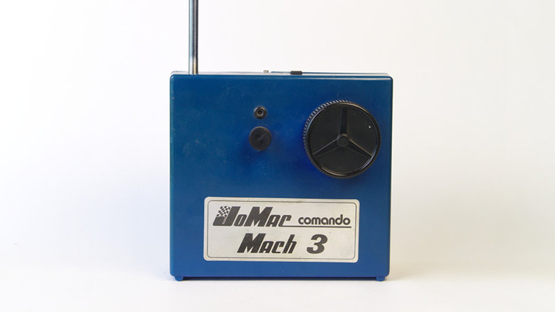

# JoMac Comando Mach 3

Reverse-engineered schematics of a JoMac Comando Mach 3 RC car Am 27 MHz 2-channel transmitter from 1982.

## Videos and photos

Overview of the transmitter:

Explaining the schematics:

High-resolution images of the transmitter can be found in our [Flickr album](https://www.flickr.com/photos/78037110@N03/albums/72157672278569504)